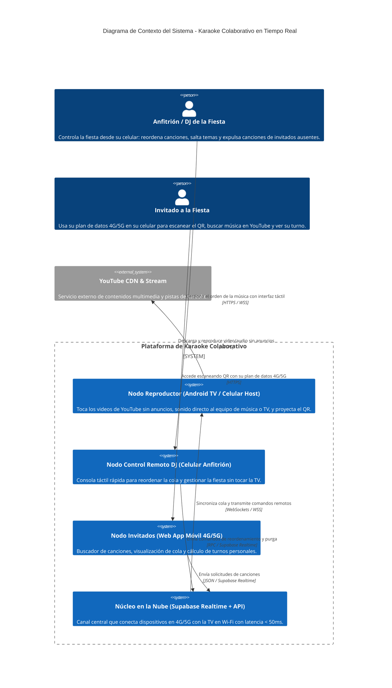
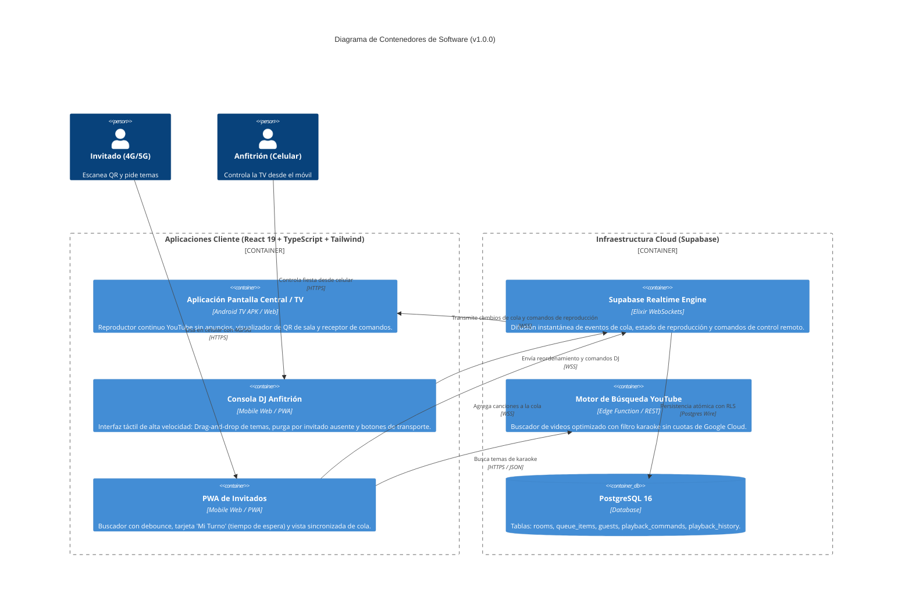
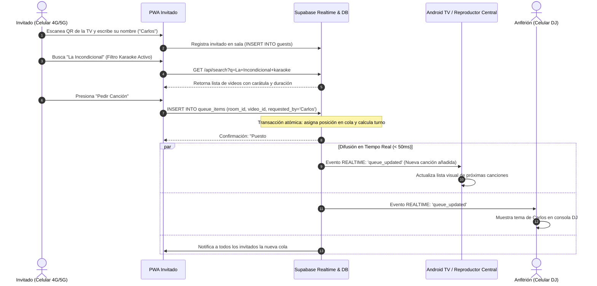
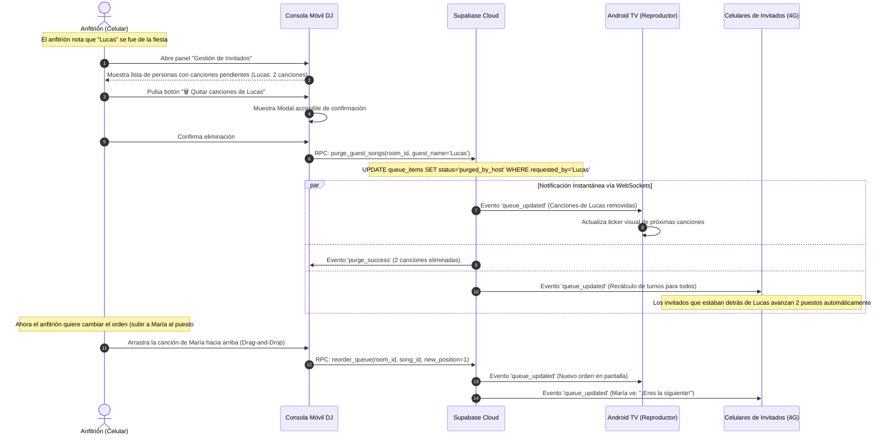
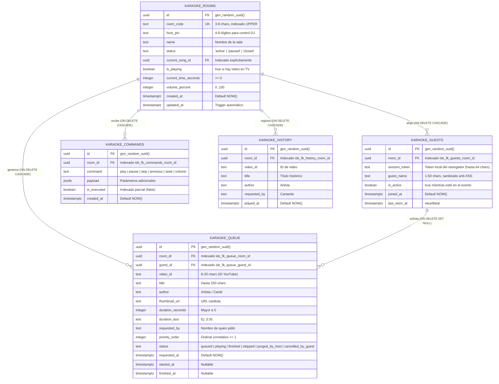
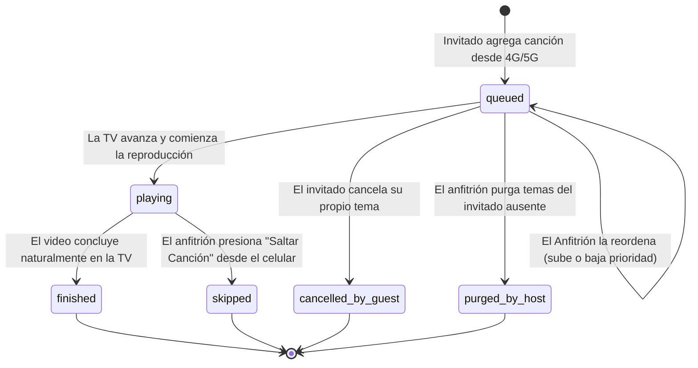

# Diagramas de Arquitectura e Interacción del Sistema de Karaoke

**Estado:** Versión 1.0.0 (Living Architecture Diagrams)  
**Formato:** Mermaid UML / C4 Model  
**Audiencia:** Ingenieros de Software, Arquitectos de Soluciones y Desarrolladores  

---

## 1. Diagrama C4 de Contexto del Sistema

---

## 2. Diagrama C4 de Contenedores de Software

---

## 3. Diagrama de Secuencia: Petición de Canción (Invitado 4G -> TV en Wi-Fi)

---

## 4. Diagrama de Secuencia: Control Remoto del Anfitrión desde el Celular

Este flujo resuelve el requerimiento de que **el anfitrión controle la TV desde su celular** (para no usar el incómodo control remoto físico de la TV) al momento de reordenar canciones o eliminar los temas de un invitado que se fue.

---

## 5. Diagrama Entidad-Relación (ERD) Optimizado (Supabase Best Practices)

El esquema aplica las recomendaciones oficiales de `supabase-postgres-best-practices`:
- Tipos de datos estándar (`TEXT` con restricciones `CHECK` en lugar de `VARCHAR` arbitrarios).
- Marcas de tiempo conscientes de zona horaria (`TIMESTAMPTZ`).
- Índices explícitos obligatorios en todas las columnas con Claves Foráneas (FK) para evitar bloqueos de tabla y asegurar rendimiento en operaciones `ON DELETE CASCADE`.
- Disparador automático `updated_at` para auditoría temporal.
- Índices parciales sobre estados calientes (`WHERE status = 'queued'`).

---

## 6. Diagrama de Estados de una Canción en Cola

