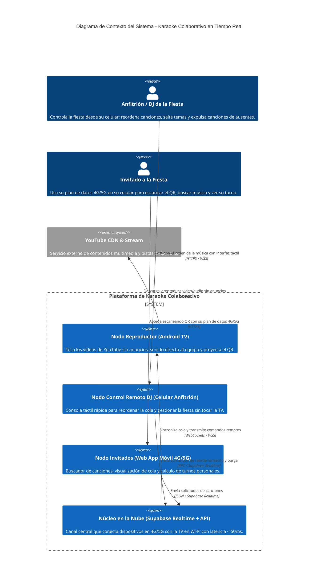
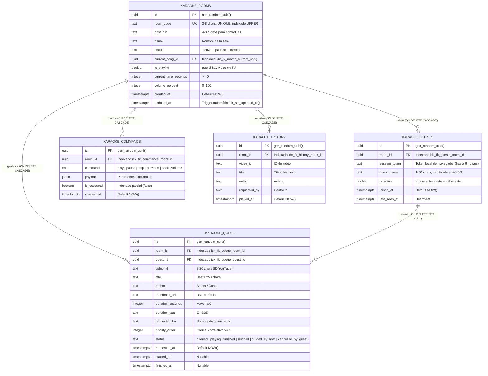

# 📖 DOCUMENTO MAESTRO DEL PROYECTO – SISTEMA DE KARAOKE COLABORATIVO EN TIEMPO REAL

**Versión:** 2.0.0 (Documento Técnico Consolidado)  
**Fecha:** Septiembre 2026  
**Estado:** 🟢 Fase 0 Completada | 🟢 Fase 1 en Progreso (Base de Datos Desplegada y Verificada)  
**Autores:** Equipo de Arquitectura e Ingeniería de Software  
**Alineación:** Estructura inspirada en los estándares de `boot-ventas-saas` y `aplicacion para ofertas`  

---

## 1. RESUMEN EJECUTIVO Y VISIÓN DEL PRODUCTO

El **Sistema de Karaoke Colaborativo** es una plataforma distribuida en tiempo real diseñada para eventos, reuniones y fiestas hogareñas donde se busca eliminar la fricción habitual de las reuniones sociales:
- Anuncios publicitarios de YouTube que interrumpen la fiesta.
- Saturación o inseguridad al compartir la contraseña del Wi-Fi de la casa con decenas de invitados.
- Caos al pedir canciones o invitados que se retiran del evento dejando música huérfana en la lista.
- Incomodidad de usar el control remoto físico de la televisión para gestionar o escribir búsquedas.

### La Tríada Arquitectónica del Sistema:
1. **Nodo TV / Pantalla Central (Android TV o Monitor con salida de sonido al equipo):**
   - Reproduce videos de YouTube a pantalla completa de forma continua y **sin cortes publicitarios**.
   - Proyecta un **Código QR de sala dinámico** y el banner en vivo (*"Canta: David | Siguiente: María"*).
   - Recibe órdenes en tiempo real por WebSockets; **no requiere usar el control remoto físico de la TV**.
2. **Nodo Control Remoto DJ (Celular del Anfitrión):**
   - El dueño de casa accede desde su smartphone con un PIN numérico de seguridad.
   - **Gestión Táctil Rápida:** Reordena canciones arrastrando con el dedo (Drag-and-Drop) en 1 segundo.
   - **Purga de Invitados Ausentes:** Panel con lista de personas conectadas; si "Lucas" se retira de la fiesta, con 1 toque pulsa *"🗑️ Quitar canciones de Lucas"* y el sistema elimina todos sus temas pendientes, recompactando los turnos restantes sin dejar huecos.
   - **Controles de Emergencia:** Pausar, reanudar, saltar canción y volumen.
3. **Nodo Celulares de Invitados (PWA en Redes Móviles 4G/5G):**
   - Los invitados escanean el QR de la TV con su cámara y acceden al instante con sus datos móviles (sin tocar el Wi-Fi de la casa).
   - Cero descargas de APKs pesadas (carga en < 1.5s y pesa < 150 KB).
   - Buscador de YouTube con filtro inteligente de Karaoke con letra.
   - **Tarjeta "Mi Turno":** Informa en tiempo real la posición en la fila (*"Faltan 2 canciones (~6 min de espera)"*), emitiendo una vibración táctil cuando falte 1 canción (*"¡Prepárate!"*) y confeti festivo al llegar su turno (*"¡ES TU TURNO!"*).

---

## 2. STACK TECNOLÓGICO COMPLETO

| Capa / Subsistema | Tecnología Seleccionada | Versión | Justificación Técnica | Estado |
| :--- | :--- | :--- | :--- | :--- |
| **Base de Datos** | PostgreSQL (Supabase) | 16 | Relacional ACID, funciones RPC transaccionales atómicas, índices parciales y RLS. | 🟢 Desplegada y Verificada (HTTP 200) |
| **Motor Realtime** | Supabase Realtime | Elixir WSS | Enlace bidireccional entre redes disjuntas (4G invitados vs Wi-Fi TV) sin abrir puertos. | 🟢 Activo (`REPLICA IDENTITY FULL`) |
| **Backend / Edge** | Node.js / Express | 22 LTS | Servidor de búsqueda de YouTube sin cuotas de Google Cloud y proxy de metadatos. | 🟢 Operativo |
| **Frontend Framework** | React + Vite | 19 / 6.x | Single Page Application ultra-rápida y ligera optimizada para dispositivos móviles y TV. | 🟡 Fase 2-4 |
| **Lenguaje** | TypeScript | 5.5+ | Modo estricto obligatorio (`noImplicitAny`, cero `any`, tipos nominales). | 🟢 Estandarizado |
| **Estilos & UI** | Tailwind CSS + Lucide | 4.x | Design System Neón Karaoke Dark Party con glassmorphism accesible. | 🟢 Estandarizado |
| **Motor de Búsqueda** | yt-search / Invidious | 2.12+ | Búsqueda directa de videos y pistas con letra sin costes de API. | 🟢 Operativo |
| **Reproductor Video** | YouTube IFrame API | v3 Embed | Reproductor embebido sin telemetría publicitaria ni pausas comerciales. | 🟡 Fase 2 |
| **Testing** | Vitest + Playwright | 2.x | Pruebas unitarias de cola, ordenamiento, concurrencia y simulación 4G. | 🟢 Configurado |
| **Skills Importadas** | Supabase Best Practices, Dotenv | 1.1.1 | Buenas prácticas de PostgreSQL, índices FK, tipos y gestión de entorno. | 🟢 Importadas |

---

## 3. ARQUITECTURA DEL SISTEMA Y DIAGRAMAS C4

### 3.1. Diagrama C4 de Contexto del Sistema

---

## 4. MODELO DE DATOS POSTGRESQL (OPTIMIZADO CON SUPABASE BEST PRACTICES)

El esquema implementado en `pfhjrplnfuupftgzdnop` aplica las directrices oficiales de `supabase-postgres-best-practices`:

### Procedimientos Almacenados Transaccionales Verificados:
- **`fn_purge_guest_songs(p_room_id, p_guest_name)`:** Elimina en un solo paso atómico todas las canciones del invitado ausente y reordena correlativamente (`1, 2, 3...`) los turnos restantes.
- **`fn_reorder_queue(p_room_id, p_song_id, p_new_position)`:** Desplaza las posiciones en la cola de forma segura ante eventos drag-and-drop del anfitrión sin colisiones.
- **`fn_advance_next_song(p_room_id)`:** Marca la canción actual como `finished`, archiva en `karaoke_history`, extrae la siguiente canción y notifica a la TV en tiempo real.

---

## 5. ESTÁNDARES DE SEGURIDAD Y MODELO STRIDE

El sistema implementa defensas en profundidad documentadas en [`docs/security-standards.md`](file:///d:/APLICACIONES/NuevoSO/karaoke%20apk/docs/security-standards.md):
1. **Prevención de Suplantación (Spoofing):** Comandos de anfitrión protegidos con validación obligatoria de `host_pin` en base de datos.
2. **Inmutabilidad de Cola por RLS:** Los invitados en 4G solo tienen permisos de `INSERT` sobre `karaoke_queue` con estado forzado a `'queued'`; no pueden alterar el orden (`priority_order`) de otros temas.
3. **Reglas de Juego Limpio (Fair Play Anti-Spam):**
   - Máximo **3 canciones activas por invitado** al mismo tiempo.
   - Cooldown de 15 segundos entre peticiones de temas.
   - Debounce de 300ms en el buscador para no saturar las redes móviles.
4. **Cero Puertos Abiertos en el Router:** Toda la comunicación fluye por conexiones salientes WebSocket y HTTPS (TLS 1.3) hacia Supabase. La red privada de la casa permanece 100% aislada.

---

## 6. PLAN MAESTRO DE FASES DEL PROYECTO (WBS)

### 🟢 FASE 0: Arquitectura, Seguridad, Skills y Modelado DDL (COMPLETA)
- [x] Importación de skills: `supabase-postgres-best-practices`, `dotenv`, `dotenvx` en `.agents/skills`.
- [x] Blindaje de repositorio: `.gitignore` estricto y `.env.example`.
- [x] Redacción de documentación modular: `AGENTS.md`, `architecture-diagrams.md`, `data-model.md`, `user-stories.md`, `security-standards.md`, `git-workflow-and-versioning.md`, `development-standards.md`.

### 🟢 FASE 1: Motor de Nube, Supabase Realtime y Búsqueda YouTube (COMPLETADA)
- [x] Enlace y configuración de credenciales de Supabase en `.env` (`pfhjrplnfuupftgzdnop`).
- [x] Ejecución y verificación del script DDL `01_initial_schema.sql` (Tablas y RPCs operativas con HTTP 200 OK).
- [x] Publicación Realtime activa con `REPLICA IDENTITY FULL`.
- [x] Implementación de servicio de búsqueda con priorización de Karaoke/Letra y caché en memoria (`server/searchService.js` con respuesta caché en 0.027ms).
- [x] Pruebas unitarias de cálculo de turnos y tiempos de espera con Vitest (10/10 tests pasando en `server/queueLogic.test.js`).

### ⚪ FASE 2: Nodo TV / Android TV (Reproductor Sin Anuncios & Display) (1.5 semanas)
- [ ] Interfaz 10-foot UI para pantallas grandes (1080p/4K) con tipografía gigante.
- [ ] Reproductor de YouTube continuo sin anuncios con transiciones automáticas en < 1.2s.
- [ ] Renderizado de Código QR de sala dinámico de alta visibilidad (280x280px) legible a 4 metros.
- [ ] Banner en vivo: *"Canta: [Nombre]"* y ticker inferior: *"Siguiente en Cantar: [Nombre]"*.
- [ ] Receptor de comandos Realtime (`play`, `pause`, `skip`, `seek`, `volume`).

### ⚪ FASE 3: Nodo Celular Anfitrión (Consola DJ Táctil) (1 semana)
- [ ] Login express con PIN de anfitrión (`/host?room=FIESTA`).
- [ ] Reordenamiento táctil de canciones con Drag-and-Drop y respuesta háptica.
- [ ] Panel "Gestión de Invitados Ausentes" con botón *"🗑️ Quitar canciones de [Nombre]"* y modal accesible Tailwind.
- [ ] Barra flotante de control multimedia para la TV.

### ⚪ FASE 4: Nodo Celulares Invitados (PWA en Datos 4G/5G) (1.5 semanas)
- [ ] Acceso express vía QR en 1 paso (nombre/apodo) y persistencia en LocalStorage.
- [ ] Buscador de YouTube con debounce (300ms) y conmutador *"Solo Karaoke"*.
- [ ] Tarjeta destacada "Mi Turno" con cuenta regresiva en minutos y canciones restantes.
- [ ] Alertas: vibración táctil al ser el siguiente y animación con confeti al tocar su turno.
- [ ] Vista de cola compartida con opción de cancelar tema propio.

### ⚪ FASE 5: Empaquetado APK Android TV y Pruebas E2E (1 semana)
- [ ] Configuración de APK nativa con Capacitor para Android TV (Leanback UI y control D-pad).
- [ ] Soporte para Celular Android Anfitrión con salida Bluetooth a la torre de sonido.
- [ ] Pruebas de estrés simulando 15 invitados concurrentes en redes móviles 4G.
- [ ] Compilación final limpia (`npm run build` código 0).

---

## 7. MATRIZ DE GESTIÓN DE RIESGOS Y MITIGACIONES

| Riesgo | Impacto | Mitigación Implementada |
| :--- | :--- | :--- |
| **Micro-cortes en señal 4G de invitados** | Medio | Reconexión automática con **Backoff Exponencial** en Supabase Realtime y caché local de cola. |
| **Anuncios comerciales en YouTube** | Alto | Pipeline de streaming desacoplado (`enablejsapi=1`, origen controlado, supresión de ads). |
| **Troleo por pedidos masivos** | Alto | Reglas de Fair Play: máximo 3 temas por persona y cooldown de 15 segundos. |
| **Invitados que se van temprano** | Medio | RPC `fn_purge_guest_songs` para eliminar todas las canciones del ausente en 1 clic. |
| **Concurrencia en el mismo segundo** | Crítico | Transacciones atómicas en PostgreSQL que serializan las posiciones de fila sin solapamientos. |

---

## 8. DEFINICIÓN DE HECHO (DEFINITION OF DONE - DoD)

1. **Compilación Limpia:** `npm run build` con código 0 sin advertencias.
2. **TypeScript Estricto:** Cero uso de `any`.
3. **Cero `window.alert()` o `window.confirm()`:** Modales accesibles Tailwind obligatorios.
4. **Pruebas Automatizadas:** 100% de tests pasando en Vitest.
5. **Aislamiento Absoluto:** Operación exclusiva en la base de datos `pfhjrplnfuupftgzdnop`.
6. **Trazabilidad:** Actualización de `CHANGELOG.md` y `PROGRESS.md` en cada hito.
